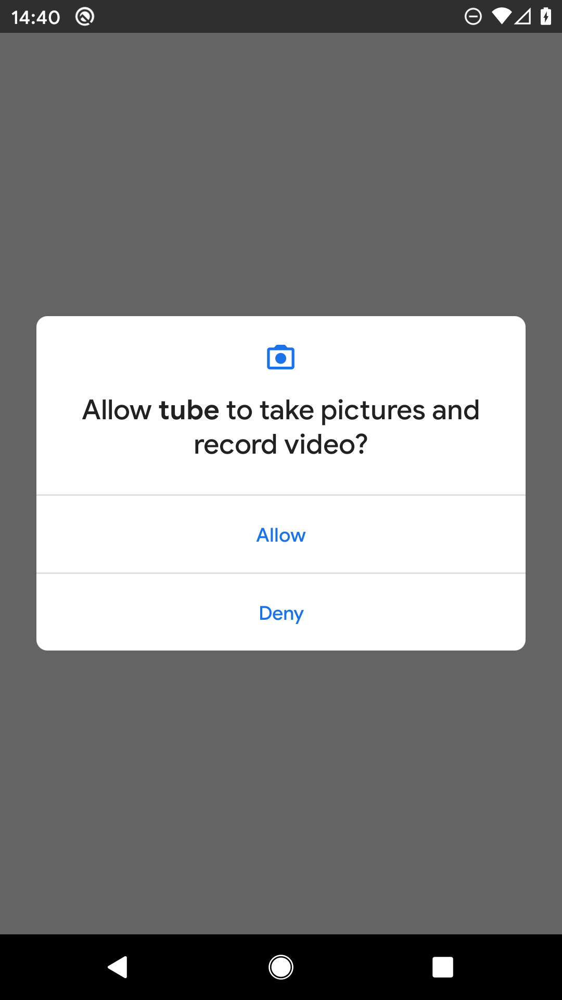
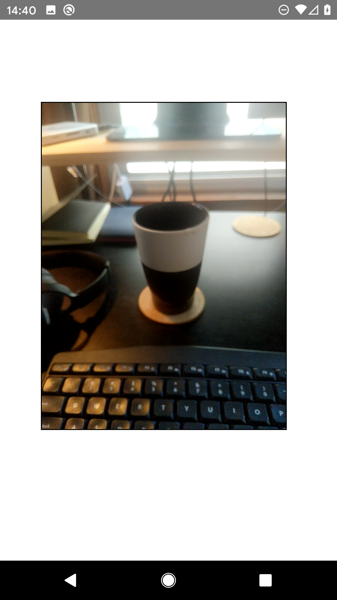
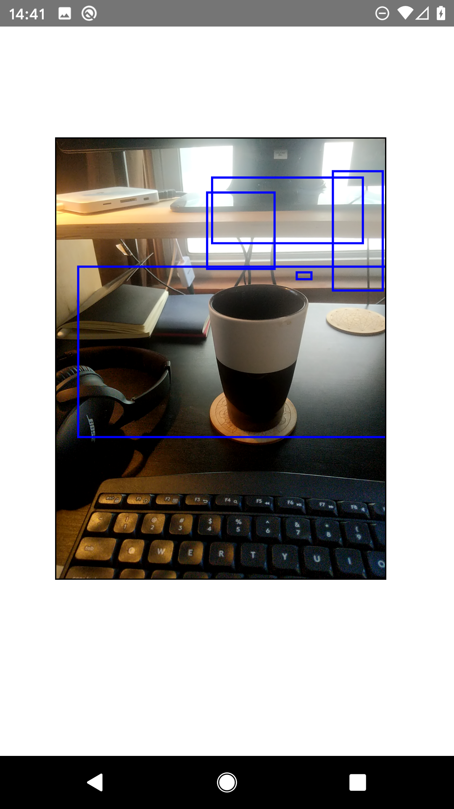
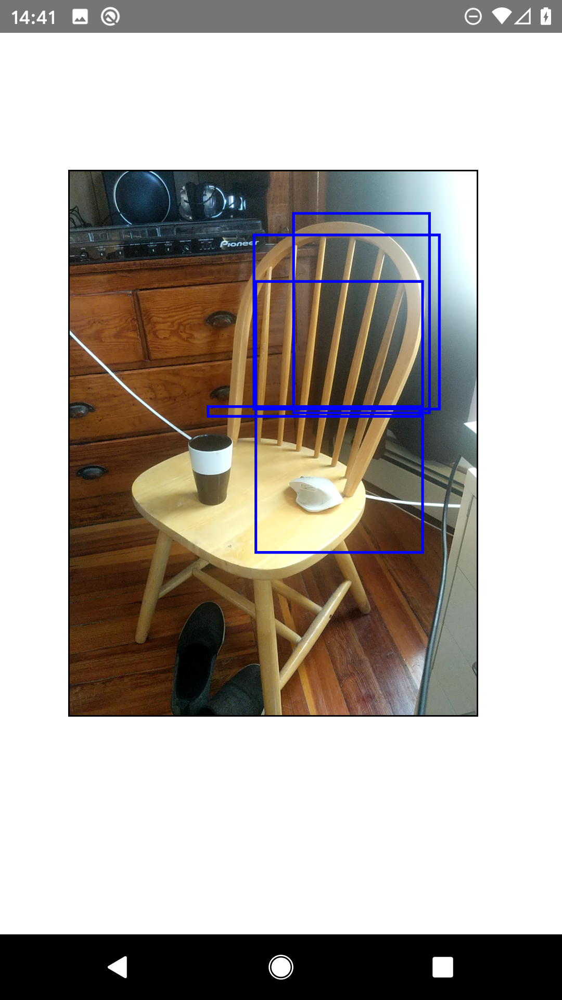
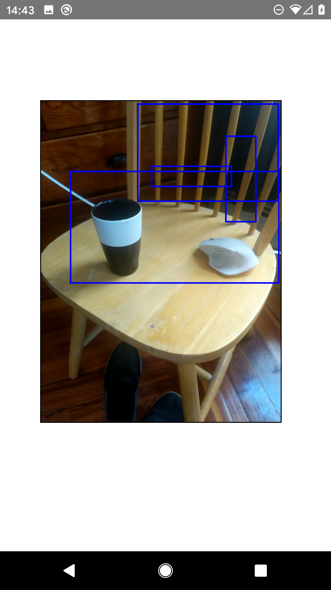
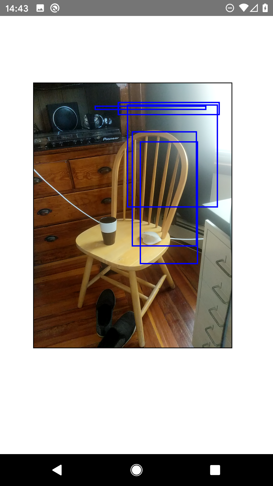

# Tubo

## Running this on Android
- Make sure you are all set up with Android Studio development, specifically with the Reactive Native flavor. 
  - Follow [Reactive Native CLI Quickstart](https://reactnative.dev/docs/environment-setup).
  - Make sure your `%%USERNAME%%` doesn't contain any whitespaces, as in `Jose Luis`... It will f*** up all your builds 😆
  - Make sure you can fire Android Studio, start a template project and deploy it in your phone.

- Make sure you can deploy a `reactive-native` app on your phone.
  - Follow [Creating a New Application](https://reactnative.dev/docs/environment-setup)

- Now, to run this, I had to do:
  - Add the following to my `/android/app/build.gradle` file [(source)](https://github.com/react-native-community/react-native-camera/blob/master/docs/migrationV2.md#android):
```
    defaultConfig {
      ...
        missingDimensionStrategy 'react-native-camera', 'general'   // add this line at the end of the block
    }
```
  - [Generate a signature key](https://github.com/facebook/react-native/issues/25629): 
```
/android/app/ $ keytool -genkey -v -keystore debug.keystore -storepass android -alias androiddebugkey -keypass android -keyalg RSA -keysize 2048 -validity 10000
```

## Output
Some screenshots of the thing working:







